# ЖКХ / Управляющая Компания — Микросервисная система

Микросервисная система для автоматизации работы ЖКХ и управляющей компании, построенная на FastAPI и Docker.

## Запуск
1. Создать .env
Можно использовать .env.example
2. Создать собственные ключи для JWT в папке certs (Приватный и публичный в core и только публичный в news и notifications). 
Также можно использовать certs.example
3. Создать приватный ключ Firebase в папке certs в Сервисе уведомлений и вписать путь к нему в .env.
Также вписать данные firebase в BFF/app/static/js/notifications.js и BFF/app/static/firebase-messaging-sw.js:
```text
firebaseConfig = {
  apiKey: "",
  authDomain: "",
  projectId: "",
  storageBucket: "",
  messagingSenderId: "",
  appId: "",
  measurementId: "",
}; (notifications и firebase-messaging-sw)
VAPID_KEY ="" (notifications) - публичный ключ
```
4. Запустить контейнеры
`docker compose up --build`

## Архитектура

Система состоит из нескольких независимых сервисов:

- **BFF (Backend For Frontend)** — frontend и единая точка входа
- **Core Service** — пользователи, роли, авторизация
- **News Service** — новости
- **Requests Service** — заявки жильцов (реализация в будущем)
- **Notifications Service** — push-уведомления

Взаимодействие между сервисами происходит:
- синхронно — через HTTP
- асинхронно — через Kafka

## Используемые технологии

### Backend
- FastAPI
- SQLAlchemy
- Pydantic
- Alembic
- httpx

### Frontend
- Jinja2
- HTML / CSS / JavaScript

### Инфраструктура
- Docker
- Docker Compose
- Kafka
- PostgreSQL

### Уведомления
- Firebase Cloud Messaging (FCM)

---

# Возможности системы

## Авторизация
- регистрация (только обычные пользователи) <br> 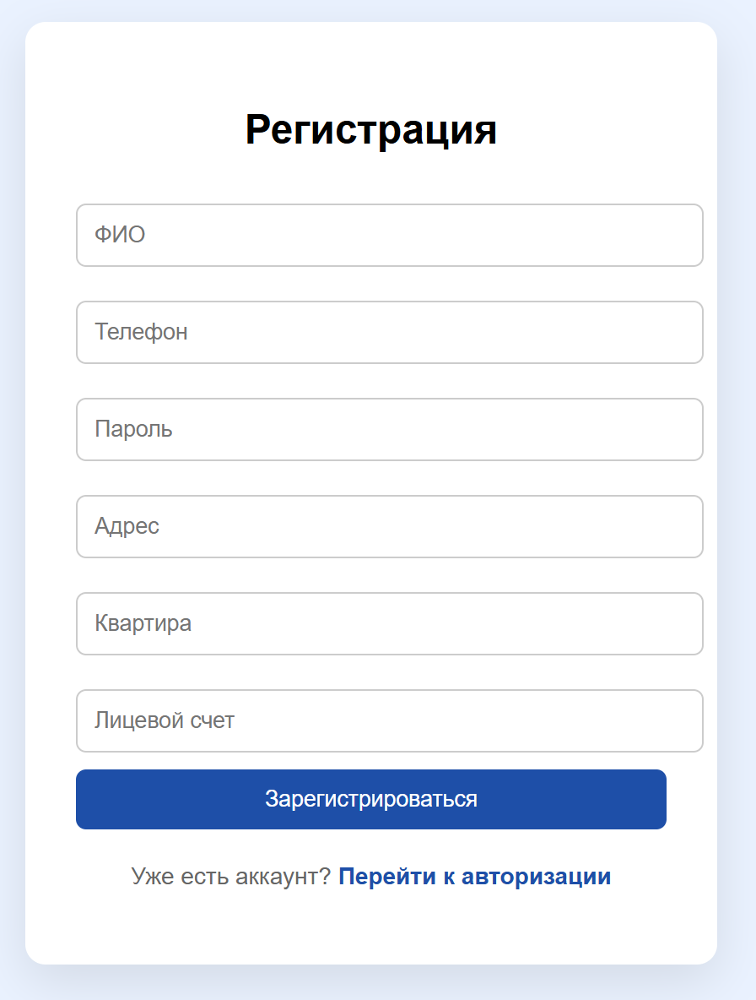
- логин / logout <br> 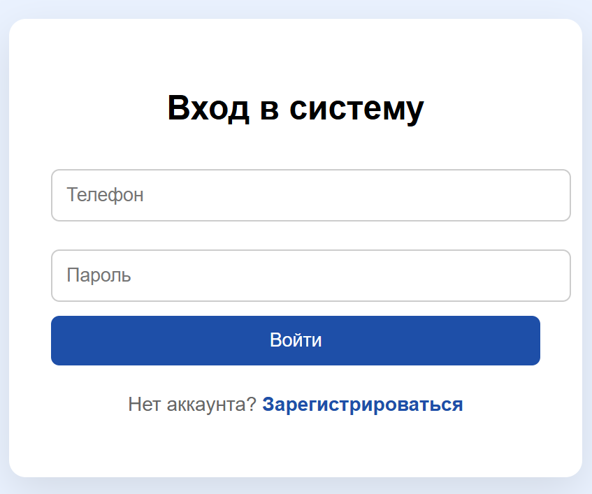
- Используются JWT access/refresh tokens
- При запуске изначально создается один админ с заданными в .env данными

## Пользователи и роли
Поддерживаются роли:
- user
- employee
- admin

## Профиль пользователя
- просмотр профиля
- редактирование профиля <br> 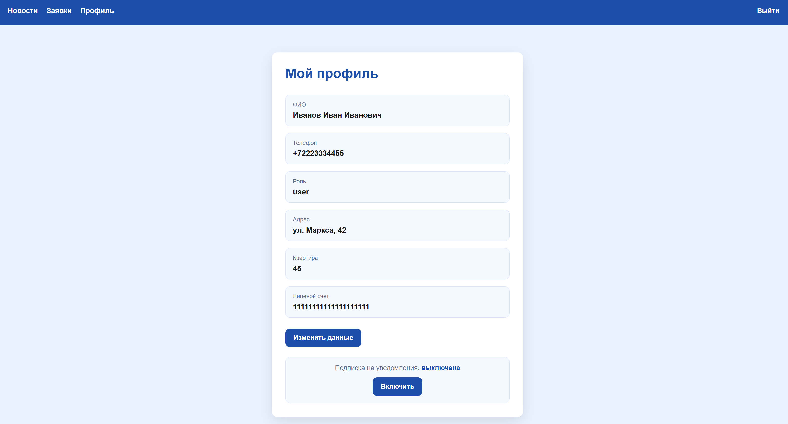

## Новости
- Просмотр новостей <br> 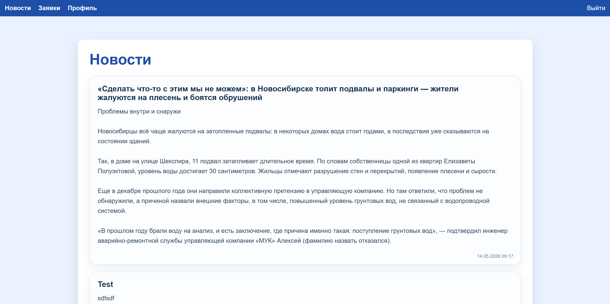
- Управление новостями и их создание (только админы) <br> 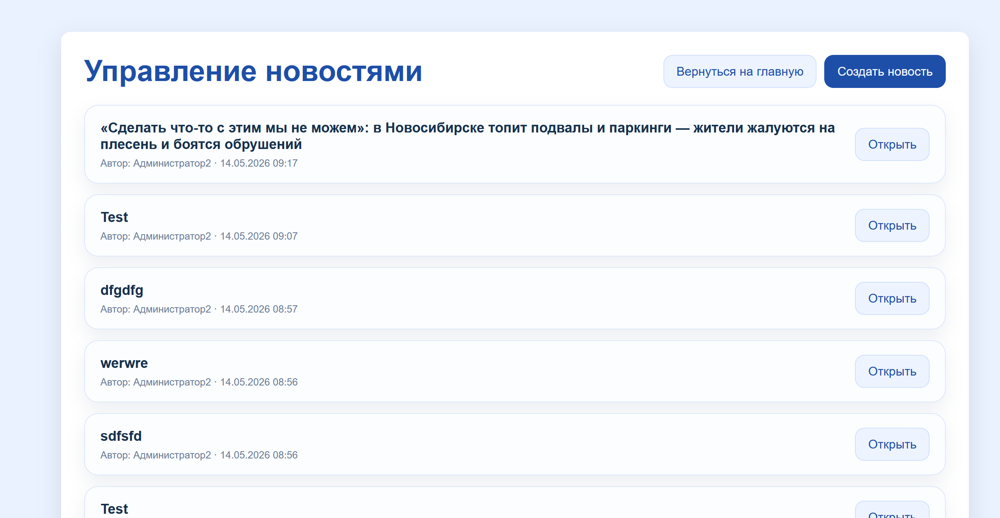 <br> 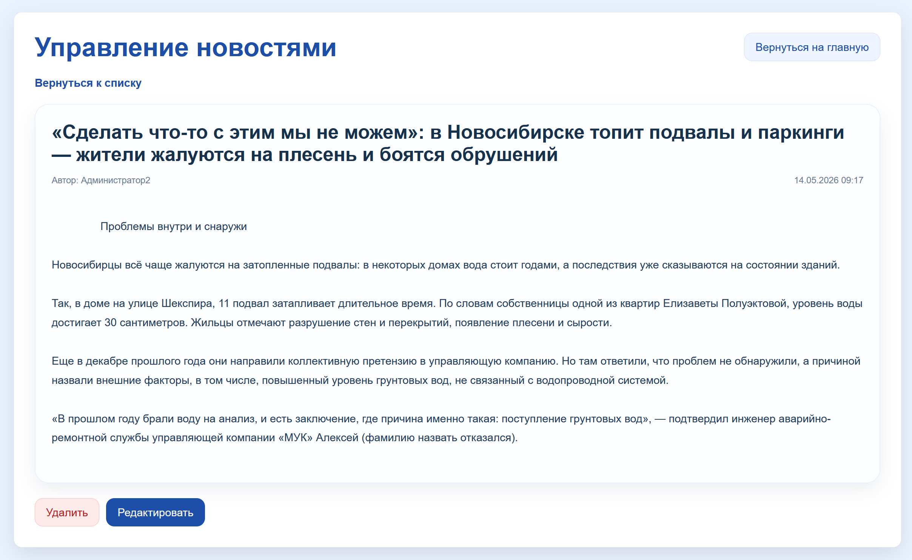 <br> 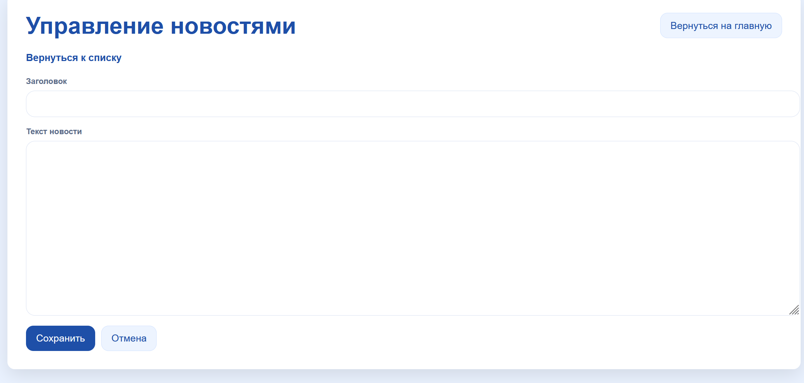

## Администрирование
(Только админ)
- просмотр пользователей и фильтрация <br> 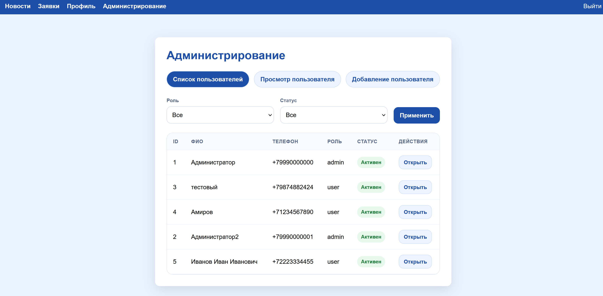
- поиск пользователей по телефону
- создание пользователей (Есть возможность добавлять сотрудников и других админов) <br> 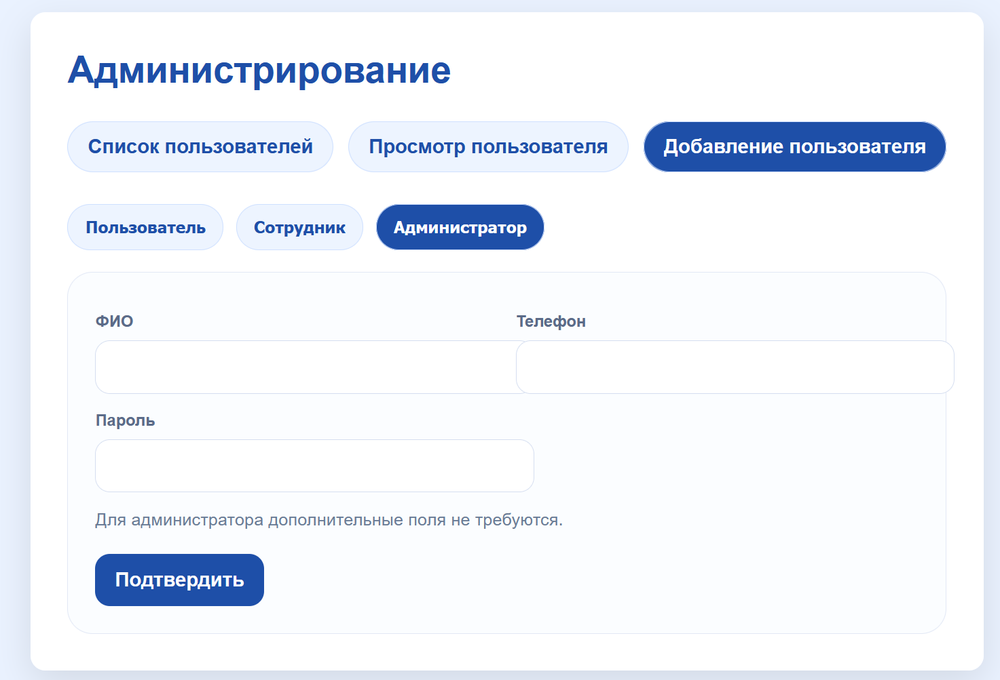
- изменение пользователей
- активация / деактивация пользователей <br> 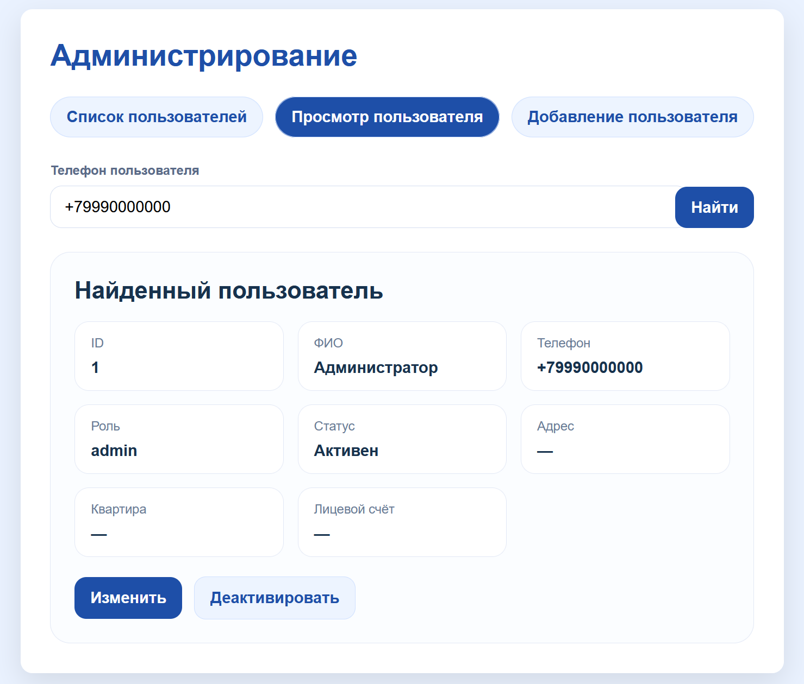

## Push-уведомления
- включение отключение уведомлений браузера о новых новостях <br> 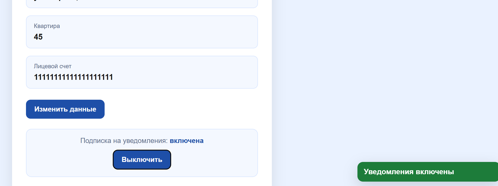 <br> 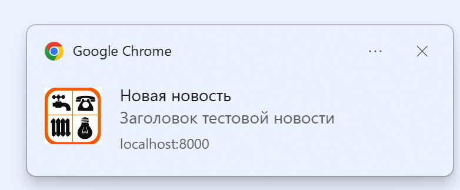
